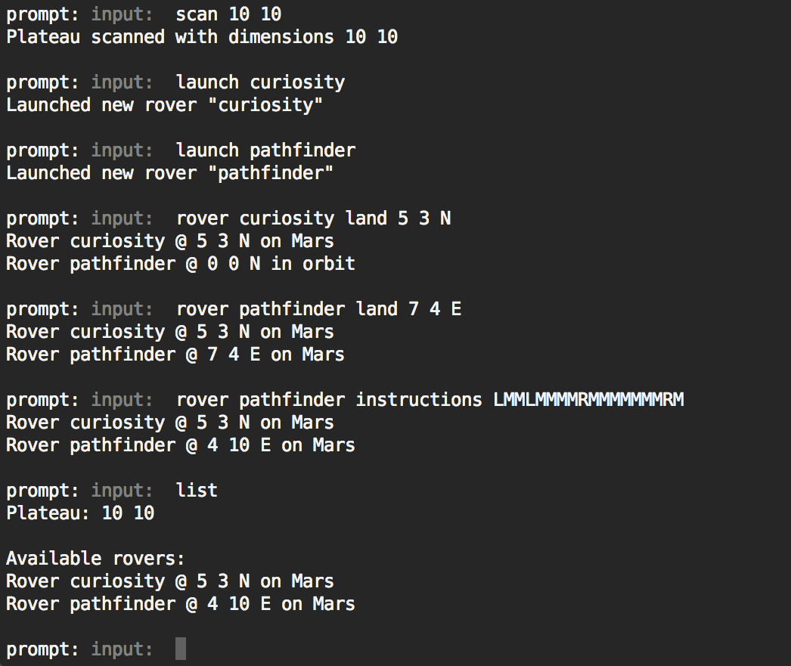

# Mars Rover

Rove the surface of Mars.

Give instructions to the rover through keyboard commands and get back results
on the rover's current position on the planet. Multiple rovers can be launched
and active at the same time.

## Installation

Requires [Node](https://nodejs.org) 5+ (developed against 5.11) and
[npm](https://www.npmjs.com/).

`npm install` from the root of the project folder.

## Usage

To start the program enter the following command from the root of the project
folder.

`npm run app`

There are multiple commands which can be issued to control your rover fleet.

### scan

Scan the surface of the planet for a suitable landing zone. Define the
dimensions of the plateau landing zone within which the rover will land.

For example, to define a 10x10 grid landing zone:

`scan 10 10`

### launch

Launch a new rover from Earth or an existing rover off the surface of Mars. In
either case a rover with the provided name will fly into orbit around Mars.

For example, to launch a rover named 'curiosity':

`launch curiosity`

### rover land

Land a rover that is currently in orbit onto the surface, within the landing
zone, at the specified coordinates and orientation.

For example, to land the rover 'curiosity' at grid position (5, 3) pointing
north:

`rover curiosity land 5 3 N`

### rover instructions

Once a rover is on the surface, it can be issued multiple movement commands at
the same time. There are 3 possible commands: `L` (rotate left), `R` (rotate
right), and `M` move forward one grid space (if still within the boundaries of
the landing zone on the plateau). These commands are sent to the rover with the
`instructions` command.

`rover curiosity instructions LMMMRMLMMMMRMMLLMM`

### list

At any point, issuing the `list` command will print out the current plateau
landing zone dimensions and a list of each active rover with its current
position (on Mars or in orbit).

### quit

Typing `quit` or `q` will end the program.

## Tests

Running all automated tests can be done by running `npm test`.
